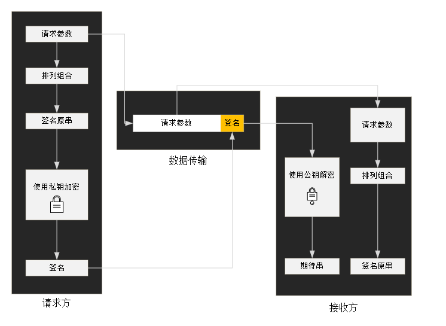

# 加密验签demo

## 签名机制概述
    为保证客户端与服务端之间消息来往的安全性，防止传递的数据被伪造，篡改，要求对所有传递的信息加入签名机制。
    目前预采用的是RSA加密方式中的md5withRSA算法实现的签名机制。
## RSA原理
    RSA 是一种非对称的签名算法，即签名密钥（私钥）与验签密钥（公钥）是不一样的，私钥用于签名，公钥用于验签。 其原理如下：

    校验规则： 当接收方的期待串与签名原串一致时， 校验成功；否则校验失败。
## 签名校验失败？
    签名校验失败有两个可能原因:
    1、请求方与接收方生成的签名原串不一致。
    当服务端作为请求的接收方时，服务端会依据客户端发送的请求数据生成签名原串，因此，请确保客户端发向服务端的请求报文中的参数的键值与客户端加签时参数的键值是相同的。 特别注意的是， 服务端本身不会对请求报文中的参数risk_item的值做首字母排序， 该参数值的顺序排列以客户端请求数据中的值为准。 
    2、请求方使用的私钥与接收方检验时使用的公钥不匹配。
    如您确保公私钥的生成过程中没有问题， 则通常是公钥不满足期待的格式（去除头尾换行）或公钥和私钥不配对所致。
    备注：绝大多数情况下， 签名校验失败的原因是双方生成的签名原串不一致。
## 获取公私钥
    推荐使用OpenSSL生成公私钥 Win64OpenSSL_Light-1_1_1g.exe，详见资源文件
    
### 生成私钥
    执行命令及预期结果如下：
    OpenSSL> genrsa -out rsa_private_key.pem 4096 Generating RSA private key, 4096 bit long modulus (2 primes) ...............................................++++ ...................................................................................................++++ e is 65537 (0x010001)
    在当前目录下会生成一个名为rsa_private_key.pem的文件， 该文件为pkcs1格式的私钥。
    
    执行以下命令将私钥转变为pkcs8格式:
    pkcs8 -topk8 -inform PEM -in rsa_private_key.pem -out rsa_private_key.txt -nocrypt
    对窗口中的私钥做去除头部、尾部、空格、换行的处理，形成最终供Java使用的私钥。
        
### 生成公钥
    在生成pkcs1格式私钥的目录下， 执行以下命令:
    rsa -in rsa_private_key.pem -pubout -out rsa_public_key.pem
    
    执行成功后， 当前目录下会生成一个新的、名为rsa_public_key.pem的文件,去除文件中的头部、尾部及换行， 形成公钥。
    备注：当公私钥成功配置后， 您应当妥善保存您的私钥。 该私钥作为客户端向服务端发送请求时加密的唯一钥匙， 如不慎泄露， 请立即重新生成公私钥以防造成请求伪造等不良影响。
## 签名串规则
    将请求参数中的各个键值对按照key的字符串顺序升序排列（自然序），value拼成一串之后最后加上密钥，组成value1value2value3value4privatekey的字符串。空串不参与签名

## 原理解析
### 签名
    1、对需要上送的报文[en_data]计算特征值[sign_block]，相关算法包括[md5、sha1、sha256、sha512等等]。
    2、使用私钥[pri_key]对sign_block加密获得数字签名[sign]。
    3、将sign与en_data打包发送给对方。
    
### 验签
    1、解析收到的报文，拆分为sign 及 en_data。
    2、对en_data计算特征值[sign_block]，相关算法包括[md5、sha1、sha256、sha512等等双方协商]。
    3、使用公钥[pub_key]对sign解密，获得sign_block1。
    4、比较sign_block 和 sign_block1，若匹配则验证成功，报文未被篡改。
## 应用
    详见客户端及服务端接入demo

